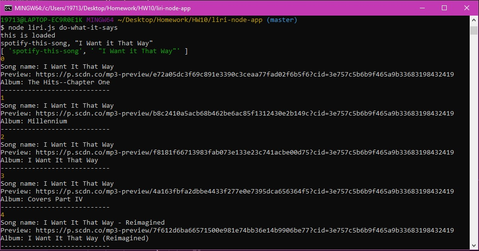

# liri-node-app
 
Node application
 
## Description 
 
LIRI is a _Language_ Interpretation and Recognition Interface. It is a command line node app that takes in parameters and gives you back data. It searches movie information, songs, and upcoming concerts. This useful for people that want information on songs, movies and concerts without having to go to multiple websites. 
 
## Spotify This Song
 
Node-Spotify-API is used to run the command "spotify-this-song" to pull up a list of songs that have the song name you enter. See image.
 
* Example: $ node liri.js spotify-this-song maps

 
##  Movie This
 
The OMDB API is used to run the command "movie-this" to pull up movie information for the movie title you search for. See image.
 
* Example: $ node liri.js movie-this titanic

 
## Concert This
 
The Bands In Town API is used to run the command "concert-this" to pull up information on an artist or bands next concert. See image.
 
* Example: $ node liri.js concert-this logic

 
## Do What It Says
 
The fs.readFile method is used to read data from the "random.txt" file. The information in the "random.text" file is then used in a search. See image.
 
* Example: $ node liri.js do-what-it-says

 
## Dependencies
 
* Windows 10
* jQuery
* Node
    * Axios
    * Node-Spotify-API
    * Moment
    * DotEnv
    * fs
* OMDB API
* Bands In Town API
 
## Author
Ria Anderson
@RiaAnderson
 
## Version History
* 0.1
..* Initial Release

